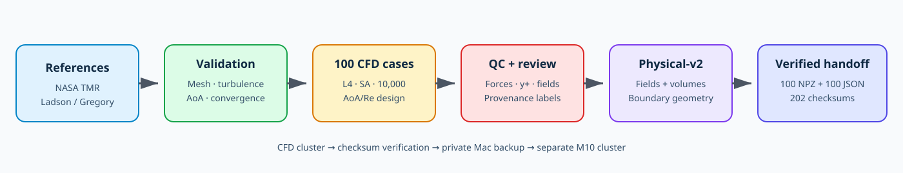
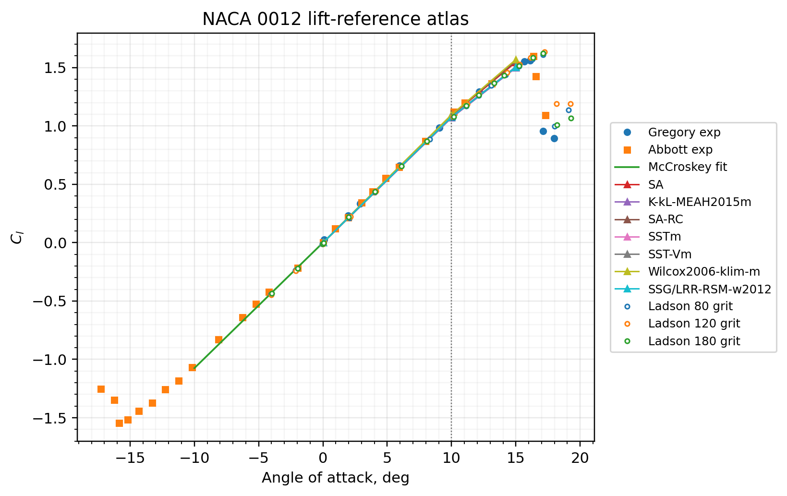
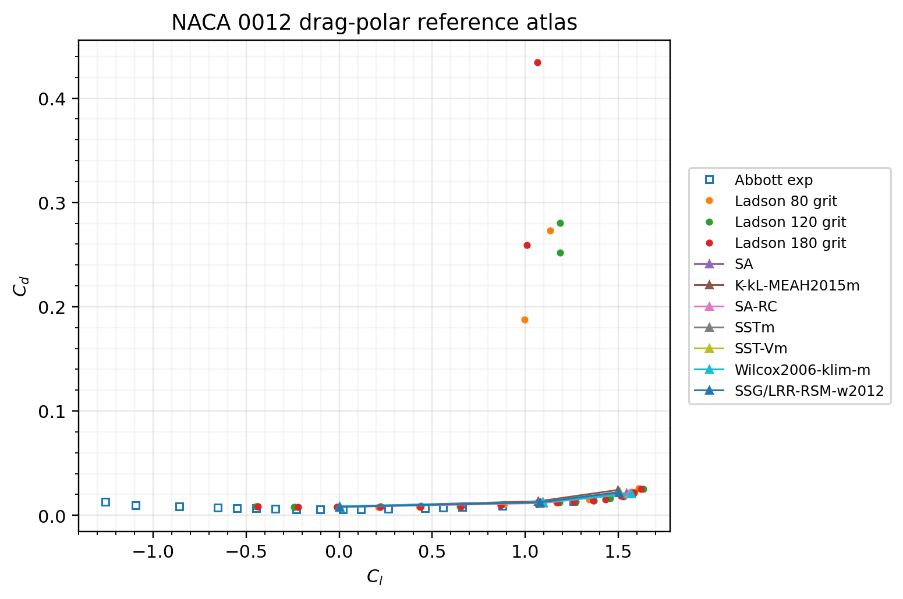
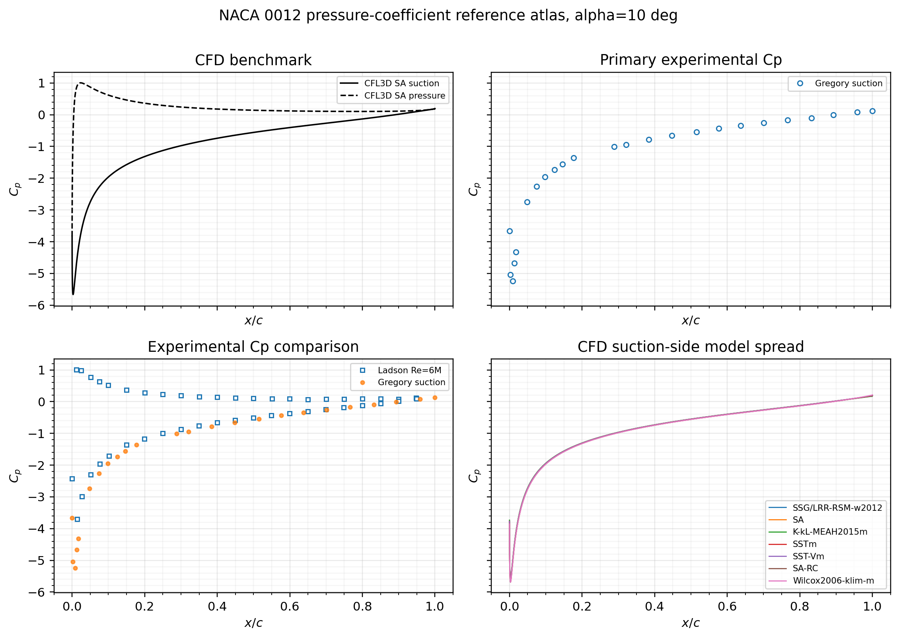
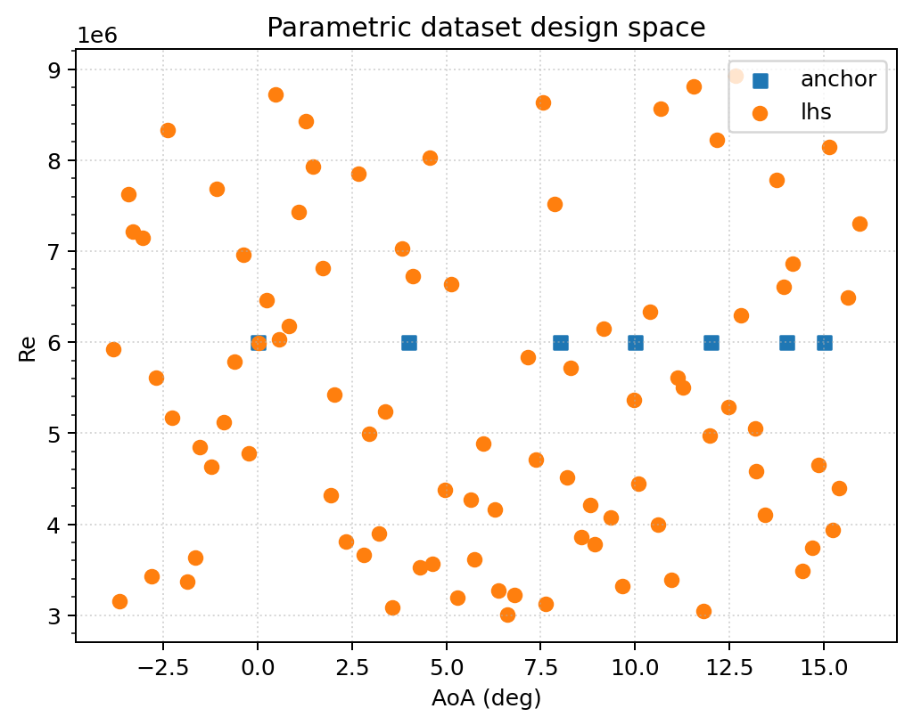
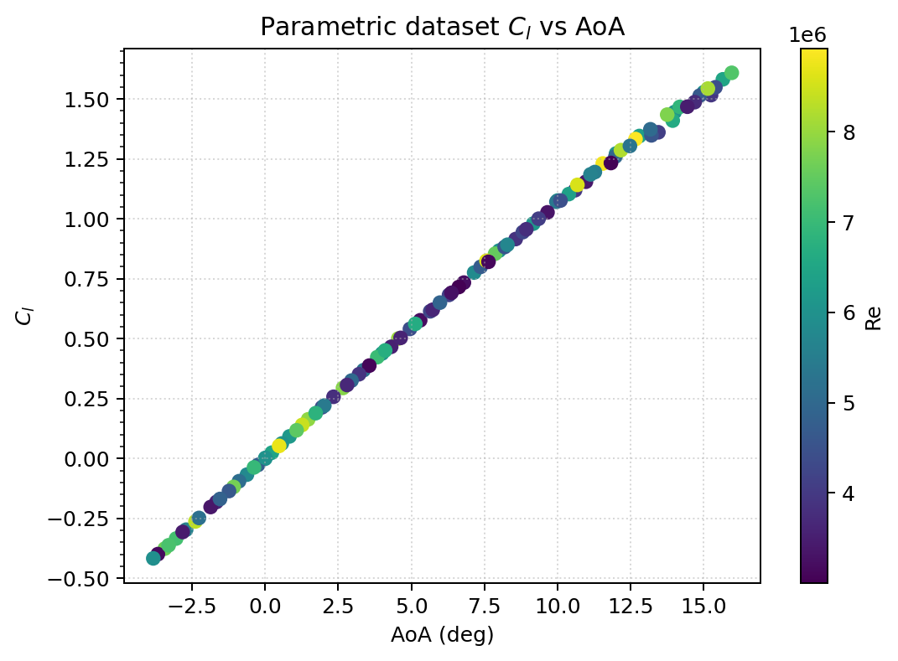
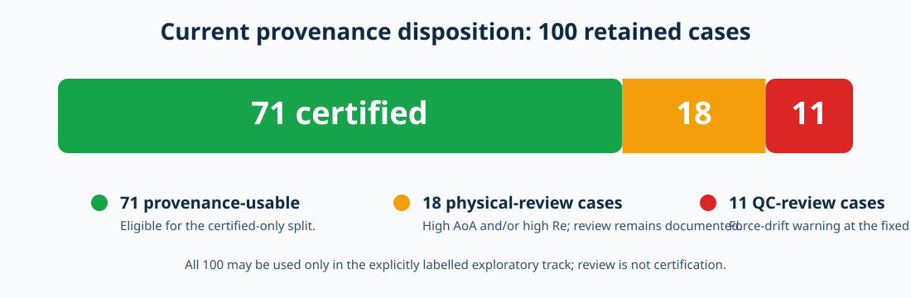
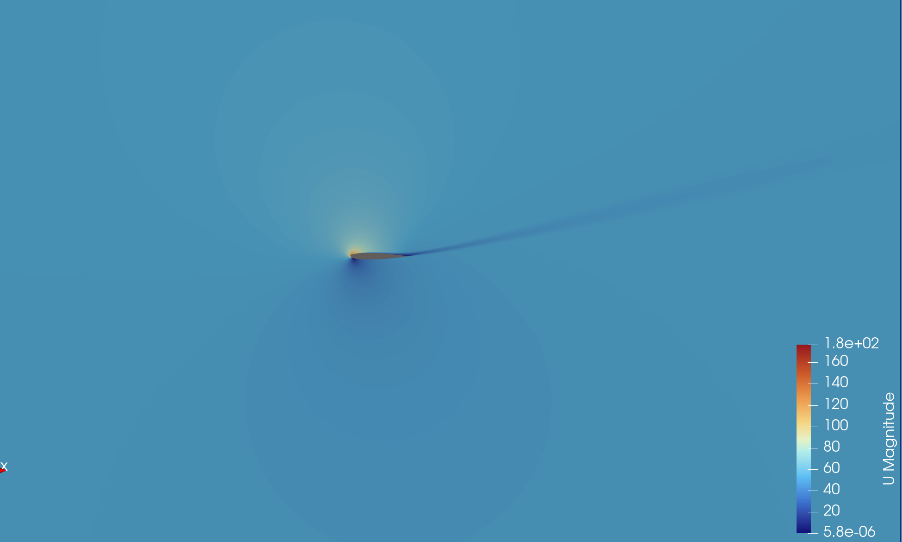

# CFD Workflow: NACA0012 Reference Dataset

This is the canonical CFD document for the project. It explains the physical
assumptions, validation sequence, production dataset, quality controls,
physical-v2 export, and verified handoff to the GNN workflow. Read this before
[GNN_WORKFLOW.md](GNN_WORKFLOW.md).

## Navigation

- [Status, objective and fixed setup](#1-outcome-and-current-status)
- [References and validation sequence](#5-reference-evidence)
- [Dataset design, execution and QC](#7-parametric-dataset-design)
- [Physical-v2 conversion and handoff](#10-physical-v2-conversion)
- [Completion gate and claim boundary](#13-cfd-completion-gate)

## 1. Outcome and current status

The CFD stage has produced a portable, checksum-verified dataset for the first
NACA0012 surrogate study.

| Item | Current result |
|---|---:|
| Designed and completed CFD cases | 100 |
| Automated QC status | 89 usable, 11 review |
| Full provenance disposition | 71 usable, 29 review, 0 reject |
| Physical-v2 snapshots | 100 NPZ files |
| Per-snapshot verification records | 100 JSON files |
| Transfer checksum entries | 202 |
| Portable raw-data size | approximately 733 MB on the CFD host |
| Mesh | one recorded L4 mesh hash across all cases |

All 100 cases are retained for the explicitly labelled exploratory track. Only
the 71 rows with `provenance_decision=usable` are currently eligible for the
certified-only track. A review label is not a failure, but it is also not a
scientific certification.



*Figure 1. The CFD cluster owns simulation, QC and conversion. The Mac is a
verified transfer/backup host. The separate M10 cluster consumes only the
portable physical-v2 bundle.*

## 2. Scientific objective

The CFD workflow supplies supervised reference fields for a fixed-geometry
NACA0012 surrogate. The intended deployable inputs are angle of attack,
Reynolds number and mesh-derived quantities. The supervised outputs are the
cell-centred flow fields required by the current model contract.

The study does not establish arbitrary-geometry generalization, compressible
flow capability, unsteady stall prediction, conservation of learned fields, or
an operational observation-updated digital twin.

## 3. Fixed physical and numerical setup

| Quantity | Protocol |
|---|---|
| Geometry | NACA0012, unit chord |
| Solver | OpenFOAM `simpleFoam` |
| Flow formulation | steady, incompressible RANS |
| Turbulence model | Spalart–Allmaras |
| Production mesh | NASA/TMR Family II level 4 |
| Production cells | 229,376 |
| Angle-of-attack domain | −4° to 16° |
| Reynolds-number domain | 3×10⁶ to 9×10⁶ |
| Freestream speed used in the cases | 51.48 m/s |
| Production cutoff | 10,000 SIMPLE iterations |
| Retained solution fields | `U`, `p`, `nuTilda` |

The OpenFOAM pressure field is kinematic pressure. Any downstream conversion
to pressure coefficient or integrated forces must use a separately validated
physical reconstruction path.

## 4. Repository ownership

Lightweight CFD source belongs under [`cfd/naca0012`](cfd/naca0012):

```text
cfd/naca0012/
├── baseCase/                    OpenFOAM template
├── references/                  tracked reference data and scripts
├── studies/
│   ├── meshIndependence/
│   ├── turbulenceModels/
│   ├── aoaVariation/
│   ├── convergenceDepth/
│   └── parametricDataset/
└── notes/                       retained background material
```

Full run directories, processor decompositions, post-processing output,
temporary ASCII cases and exported NPZ files remain outside Git.

## 5. Reference evidence

The local reference set contains NASA/TMR CFL3D data and experimental datasets
from the project’s NACA0012 reference collection. Reference curves are used to
check trends and matched conditions; they are not treated as interchangeable
when Reynolds number, transition, surface condition or turbulence model differ.



*Figure 2. Locally generated reference atlas for lift coefficient versus angle
of attack. Source arrays remain under `cfd/naca0012/references/`.*



*Figure 3. Reference drag polar. Protocol matching must be checked before any
quantitative comparison is reported.*



*Figure 4. Reference pressure-coefficient distributions at the available
α=10° condition. Surface-side coverage differs among sources.*

## 6. Validation sequence

The production configuration was selected through four ordered studies. A
later study does not retroactively repair a failed earlier gate.

### 6.1 Mesh independence

The formal comparison used Family II levels 3–7. The selected L4 mesh balances
near-wall resolution, force agreement and dataset cost.

| Level | Cells | Cl | Cd | Maximum y+ | Disposition |
|---:|---:|---:|---:|---:|---|
| 3 | 917,504 | 1.029372 | 0.01431962 | 0.16043 | usable reference trend |
| 4 | 229,376 | 1.062972 | 0.01285784 | 0.38083 | selected production mesh |
| 5 | 57,344 | 1.064086 | 0.01323472 | 0.99423 | usable |
| 6 | 14,336 | 1.040766 | 0.01672124 | 3.043 | usable but coarser |
| 7 | 3,584 | 1.004273 | 0.02264212 | 9.5037 | usable but coarser |

At the matched α=10°, Re=6×10⁶ condition, the selected L4 result was compared
with the local NASA/TMR SA and Ladson 80-grit references. These comparisons
support configuration selection; they do not establish universal accuracy.

### 6.2 Turbulence model

The fixed L4, α=10°, Re=6×10⁶ study compared SA, k–ω SST and k–ω. SA was
retained because it matches the selected NASA/TMR workflow and supports the
intended `nuTilda` target.

| Model | Cl | Cd | Cm | Maximum y+ |
|---|---:|---:|---:|---:|
| Spalart–Allmaras | 1.072128 | 0.01338199 | 0.00549481 | 0.38249 |
| k–ω SST | 1.063372 | 0.01178450 | 0.00784913 | 0.34004 |
| k–ω | 1.048775 | 0.01819684 | 0.00739671 | 0.39819 |

### 6.3 Angle-of-attack trend

Seven L4 SA anchors at Re=6×10⁶ cover α=0°, 4°, 8°, 10°, 12°, 14° and 15°.
All reached the fixed 10,000-iteration endpoint and passed the automated force
stability criteria used for that validation study.

### 6.4 Convergence depth

Candidate cutoffs at 3,000, 5,000, 7,000 and 8,000 iterations were rejected.
The production cutoff therefore remains 10,000 iterations. This is a fixed
resource/quality decision, not proof that every case is fully converged.

## 7. Parametric dataset design

The 100 cases consist of seven validation anchors and 93 log-Re Latin
hypercube samples across the frozen AoA/Re domain.



*Figure 5. AoA/Re sampling coverage from the retained cluster QC package. The
figure is descriptive of the design, not a model-performance result.*



*Figure 6. CFD lift-coefficient trend across the current cases. Review-labelled
cases remain visible; inclusion does not convert them into certified evidence.*

## 8. Production execution

The authoritative production runs remain on the CPU/OpenFOAM cluster. The
tracked workflow is under
[`cfd/naca0012/studies/parametricDataset`](cfd/naca0012/studies/parametricDataset).

The production job must preserve:

- `constant/polyMesh`;
- final-time `U`, `p` and `nuTilda`;
- force-coefficient history;
- wall-shear, y+ and surface diagnostics where configured;
- solver and reconstruction logs; and
- the case inventory metadata.

Do not rerun CFD on the M10 cluster. It receives the portable snapshots only.

## 9. Automated QC and human review

Automated Phase-2 QC checks:

- solver completion and final-time availability;
- required reconstructed fields;
- finite force and y+ diagnostics;
- final-window Cl, Cd and Cm stability;
- consistency with the case inventory; and
- snapshot/export verification.

Current automated result: 89 `usable`, 11 `review`. Most of the eleven warnings
are associated with force drift at the fixed cutoff; they are not all extreme
AoA cases.

The provenance layer adds manual physical review for high-AoA and/or high-Re
conditions. That produces the present 71/29 disposition:



*Figure 7. Provenance state of the retained all-100 bundle. The 29 review rows
remain explicitly marked `exploratory_review`.*

### Representative qualitative wake inspection



*Figure 8. ParaView velocity-magnitude view for `lhs_057` (α≈15.137°, Re≈8.149×10⁶,
final time 10,000). The wake is narrow and aligned and the field was judged
qualitatively coherent within the steady SA-RANS protocol. The case remains
`provenance_decision=review`; this screenshot is not external validation.*

## 10. Physical-v2 conversion

No CFD simulation is repeated during conversion. The exporter reads each
completed OpenFOAM case, creates a minimal temporary ASCII staging copy, and
writes a compressed NPZ snapshot.

Each physical-v2 snapshot contains:

```text
cell_centers
owner, owner_all, neighbour
U, p, nuTilda
cell_volumes
boundary_face_owner
boundary_face_centers
boundary_face_area_vectors
boundary_face_patch_ids
boundary_patch_names
is_airfoil_wall, is_farfield
case_id, aoa_deg, re, schema version, mesh hash
```

The exporter fails if volumes are non-positive, physical boundary faces are
empty, or wall/farfield mappings cannot be established.

For the current all-case workflow, the tracked Slurm entry point is:

```bash
sbatch --export=ALL \
  "$AIRFOIL_REPO_ROOT/cfd/naca0012/studies/parametricDataset/cluster/export_physical_v2_all_cases.slurm"
```

The successful production export contained 100 snapshots and 100 verification
records. Temporary ASCII staging was approximately 9.3 GB and is not required
by the GNN pipeline.

## 11. Portable bundle and verification

The portable directory is intentionally independent of the OpenFOAM cases:

```text
naca0012_l4_sa_v2/
├── SOURCE_REVISION
├── dataset_files.sha256
├── phase2_provenance_physical_v2.csv
├── qc/
└── raw/
    ├── manifest.csv
    ├── snapshots/             100 × .npz
    └── verify/                100 × .verify.json
```

Small, reviewable copies of the current
[manifest](docs/evidence/naca0012_physical_v2_manifest.csv),
[per-case provenance](docs/evidence/naca0012_physical_v2_provenance.csv),
[file checksum list](docs/evidence/naca0012_physical_v2_files.sha256), and
[exporter revision](docs/evidence/SOURCE_REVISION) are tracked as documentation
evidence. The NPZ payload remains private and ignored.

Verify after every transfer:

```bash
cd /path/to/naca0012_l4_sa_v2
sha256sum -c dataset_files.sha256 > dataset_checksum_verification.txt
test "$(grep -c ': OK$' dataset_checksum_verification.txt)" -eq 202
test "$(find raw/snapshots -name '*.npz' -type f | wc -l)" -eq 100
test "$(find raw/verify -name '*.verify.json' -type f | wc -l)" -eq 100
```

On macOS, replace `sha256sum` with `shasum -a 256`.

## 12. Host-to-host handoff

```text
CPU/OpenFOAM cluster
  └─ physical-v2 export + checksum
       ↓ private SCP/SFTP or approved institutional transfer
Mac
  └─ independent checksum verification + private backup
       ↓ private transfer
M10 cluster
  └─ graph construction and training
```

The dataset is never pushed to GitHub. The M10 operator receives the GitHub
code revision and the portable bundle through separate channels.

## 13. CFD completion gate

Completed for exploratory GNN development:

- [x] 100 completed cases retained
- [x] automated QC table produced
- [x] physical review evidence produced
- [x] provenance table produced with zero rejects
- [x] physical-v2 conversion completed
- [x] one consistent L4 mesh hash confirmed
- [x] 100 NPZ and 100 verification files generated
- [x] 202 checksums verified on the CFD cluster and Mac

Still required for certified-only scientific claims:

- [ ] resolve or rerun the 11 automated-QC review cases;
- [ ] complete documented dispositions for the 18 high-risk review cases;
- [ ] validate surface pressure/shear reconstruction before reporting predicted
  Cp, Cl, Cd or Cm; and
- [ ] retain protocol-matched evidence for every external comparison.

## 14. Claim boundary

The current dataset supports exploratory graph construction and model-pipeline
testing. It does not, by itself, support claims of benchmark-equivalent model
accuracy, validated force prediction, arbitrary-geometry generalization,
real-time operation or an operational digital twin.

Continue with [GNN_WORKFLOW.md](GNN_WORKFLOW.md).
