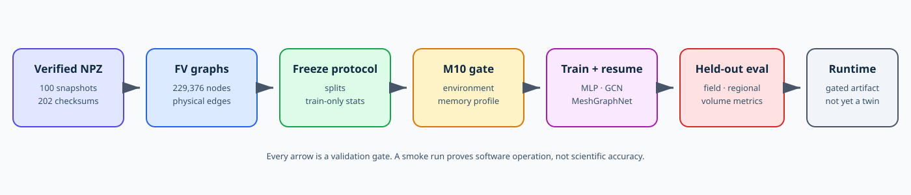
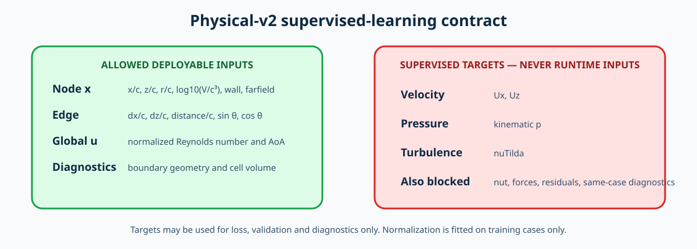

# GNN Workflow: Physical-v2 Graph Surrogate

This is the canonical GNN document for the project. It starts from the
checksum-verified physical-v2 bundle produced in
[CFD_WORKFLOW.md](CFD_WORKFLOW.md) and ends at a gated surrogate runtime. The
M10 cluster is separate from the CPU/OpenFOAM cluster.

## Navigation

- [Status, inputs and transfer verification](#1-outcome-and-current-status)
- [Graph contract and dataset tracks](#4-leakage-safe-graph-contract)
- [M10 environment and graph construction](#6-m10-environment-gate)
- [Splits, validation and normalization](#8-freeze-splits)
- [Models, memory and smoke training](#11-model-roles)
- [Evaluation, artifacts and runtime boundary](#15-evaluation-protocol)

## 1. Outcome and current status

| Stage | Status |
|---|---|
| Physical-v2 bundle | complete and checksum-verified |
| Local schema/array inspection | passed |
| Full graph export | pending on the M10 cluster |
| Split and train-only statistics | pending |
| M10 environment qualification | pending |
| Memory profile and smoke training | pending |
| Full experiments | not authorized yet |
| Operational digital twin | not validated |

The Mac’s existing general Python environment has a duplicate OpenMP runtime
conflict. It is not the release environment. Graph construction and training
must use a clean, recorded environment on the M10 cluster.



*Figure 1. GNN stages and validation gates. Passing a software smoke run does
not establish scientific model accuracy.*

## 2. Required inputs on the M10 cluster

The colleague needs two separately delivered inputs:

1. The GitHub repository at the approved immutable revision.
2. The private `naca0012_l4_sa_v2` bundle from the Mac.

OpenFOAM, the original cases and ASCII staging are not required.

Recommended external layout:

```text
/project/airfoil-digital-twin/             Git checkout
/project/private-data/naca0012_l4_sa_v2/  verified NPZ bundle
/project/airfoil-artifacts/                generated graphs/runs/reports
```

Define paths without placing generated data inside Git:

```bash
export AIRFOIL_REPO_ROOT=/project/airfoil-digital-twin
export AIRFOIL_DATASET_ROOT=/project/private-data/naca0012_l4_sa_v2
export AIRFOIL_ARTIFACT_ROOT=/project/airfoil-artifacts
mkdir -p "$AIRFOIL_ARTIFACT_ROOT/reports"
```

## 3. Verify the transferred bundle

Run before installing dependencies or building graphs:

```bash
cd "$AIRFOIL_DATASET_ROOT"
sha256sum -c dataset_files.sha256 \
  > "$AIRFOIL_ARTIFACT_ROOT/reports/dataset-checksums.txt"
test "$(grep -c ': OK$' "$AIRFOIL_ARTIFACT_ROOT/reports/dataset-checksums.txt")" -eq 202
test "$(find raw/snapshots -name '*.npz' -type f | wc -l)" -eq 100
test "$(find raw/verify -name '*.verify.json' -type f | wc -l)" -eq 100
```

Stop if any checksum or count differs. Do not repair a failed transfer by
deleting cases or editing the manifest.

## 4. Leakage-safe graph contract

Graph nodes are OpenFOAM finite-volume cells. Edges use the internal-face
`owner`/`neighbour` topology, duplicated in both directions. K-nearest-neighbor
connectivity is not a substitute for this contract.



*Figure 2. Only geometry, mesh, boundary and operating conditions are
deployable inputs. CFD solution fields remain targets.*

### Node features

```text
x = [x/c, z/c, r/c, log10(V/c³), is_airfoil_wall, is_farfield]
```

### Edge features

```text
edge_attr = [dx/c, dz/c, distance/c, sin(theta), cos(theta)]
```

### Global condition

```text
u = [log-Re normalized to the study range, AoA normalized to the study range]
```

### Supervised targets

```text
y = [Ux, Uz, kinematic p, nuTilda]
```

`U`, `p`, `nuTilda`, `nut`, force coefficients, residuals and same-case
convergence diagnostics are forbidden as deployable inputs. They may be used
only as targets, validation labels or diagnostics.

## 5. Dataset tracks

The manifest carries both automated QC and provenance labels.

| Track | Cases | Purpose | Claim boundary |
|---|---:|---|---|
| All-case exploratory | 100 | pipeline development and sensitivity checks | not certified |
| Certified-only | 71 currently | primary defensible evaluation subset | still subject to downstream ML gates |

The 29 review rows remain present in graph metadata as
`dataset_scope=exploratory_review`. Never silently relabel them.

## 6. M10 environment gate

### Optional synthetic software check

A fresh clone can exercise the CPU software path without using the scientific
dataset. These synthetic artifacts are never valid for aerodynamic or accuracy
claims:

```bash
python scripts/create_demo_npz_dataset.py \
  --outdir data/raw/demo_naca0012_tiny --num-cases 8
python scripts/export_naca_graphs.py \
  --manifest data/raw/demo_naca0012_tiny/manifest.csv \
  --input-format npz \
  --outdir data/processed/demo_naca0012_tiny/graphs
python scripts/build_splits.py \
  --manifest data/raw/demo_naca0012_tiny/manifest.csv \
  --out data/splits/demo_naca0012_tiny_splits.json
python scripts/check_graph_dataset.py \
  --graph-dir data/processed/demo_naca0012_tiny/graphs \
  --splits data/splits/demo_naca0012_tiny_splits.json
python scripts/compute_stats.py \
  --graph-dir data/processed/demo_naca0012_tiny/graphs \
  --splits data/splits/demo_naca0012_tiny_splits.json \
  --out data/processed/demo_naca0012_tiny/normalization_stats.json
```

### M10 qualification

The Tesla M10 is a Maxwell device with 8 GB per visible GPU. Memory is not
pooled across ordinary multi-GPU jobs. The environment must be qualified on the
actual M10 compute node before graph training.

Create the base environment from [`environment-m10.yml`](environment-m10.yml),
then install a PyTorch/CUDA wheel whose published architecture list still
supports Maxwell. Confirm the exact wheel against official PyTorch guidance at
installation time; do not use an unconstrained latest CUDA build.

Required evidence:

```bash
nvidia-smi
python scripts/check_environment.py --require-gpus 1 --require-name "Tesla M10"
python -m pytest -q
conda env export --from-history
python -m pip freeze
```

The environment check must show a compatible CUDA cubin and must complete a
forward/backward tensor operation on each required device.

## 7. Build physical-v2 graphs

Run from the Git checkout in the clean ML environment:

```bash
cd "$AIRFOIL_REPO_ROOT"
mkdir -p "$AIRFOIL_ARTIFACT_ROOT/naca0012_l4_sa_v2/graphs"

python scripts/export_naca_graphs.py \
  --manifest "$AIRFOIL_DATASET_ROOT/raw/manifest.csv" \
  --input-format npz \
  --schema-version v2 \
  --chord 1.0 \
  --outdir "$AIRFOIL_ARTIFACT_ROOT/naca0012_l4_sa_v2/graphs"
```

Expected per graph:

- 229,376 nodes;
- 915,584 directed internal-face edges;
- six node features;
- five edge features;
- two global condition values;
- four supervised target fields;
- non-empty wall and farfield signals;
- physical boundary-face tensors; and
- the same recorded mesh hash across all cases.

## 8. Freeze splits

### Exploratory all-100 split

```bash
python scripts/build_splits.py \
  --manifest "$AIRFOIL_DATASET_ROOT/raw/manifest.csv" \
  --mode stratified \
  --out "$AIRFOIL_ARTIFACT_ROOT/naca0012_l4_sa_v2/all_cases_exploratory_split.json"
```

### Certified-only split

```bash
python scripts/build_splits.py \
  --manifest "$AIRFOIL_DATASET_ROOT/raw/manifest.csv" \
  --mode stratified \
  --provenance-decision usable \
  --out "$AIRFOIL_ARTIFACT_ROOT/naca0012_l4_sa_v2/certified_only_split.json"
```

Initial development uses a stratified interpolation split. Harder protocols
must be separate frozen experiments:

- high/low AoA extrapolation;
- high/low Reynolds extrapolation; and
- joint AoA/Re corner holdout.

## 9. Validate graphs

Validate each selected split independently:

```bash
python scripts/check_graph_dataset.py \
  --graph-dir "$AIRFOIL_ARTIFACT_ROOT/naca0012_l4_sa_v2/graphs" \
  --splits "$AIRFOIL_ARTIFACT_ROOT/naca0012_l4_sa_v2/all_cases_exploratory_split.json" \
  --edge-dim 5 \
  --expected-num-nodes 229376 \
  --require-boundary-signal \
  --require-physical-geometry
```

The validator checks tensor shapes, finite values, connectivity, paired reverse
edges, split coverage, operating-condition consistency, topology, target
ranges, boundary signals and direct input-target leakage.

## 10. Compute train-only normalization

Statistics must be recomputed for every split protocol and must never use
validation or test cases.

```bash
python scripts/compute_stats.py \
  --graph-dir "$AIRFOIL_ARTIFACT_ROOT/naca0012_l4_sa_v2/graphs" \
  --splits "$AIRFOIL_ARTIFACT_ROOT/naca0012_l4_sa_v2/all_cases_exploratory_split.json" \
  --out "$AIRFOIL_ARTIFACT_ROOT/naca0012_l4_sa_v2/normalization_all_cases.json"

python scripts/compute_stats.py \
  --graph-dir "$AIRFOIL_ARTIFACT_ROOT/naca0012_l4_sa_v2/graphs" \
  --splits "$AIRFOIL_ARTIFACT_ROOT/naca0012_l4_sa_v2/certified_only_split.json" \
  --out "$AIRFOIL_ARTIFACT_ROOT/naca0012_l4_sa_v2/normalization_certified_only.json"
```

Do not reuse exploratory statistics for certified-only evaluation.

## 11. Model roles

| Model | Role |
|---|---|
| Node MLP | topology-free baseline |
| GCN | simple topology-aware baseline |
| MeshGraphNet | primary edge-aware finite-volume graph model |
| Graph U-Net | multiscale comparison after the baseline gate |
| GAT, GraphSAGE, GIN, MPNN | optional controlled model-family comparisons |

Model comparisons hold split, features, optimizer policy, stopping rule, seed
policy and metrics fixed where feasible. Input/output dimensions may follow the
dataset contract without changing the identity of a model family.

## 12. Single-M10 memory gate

Before training, run one complete forward/backward/AdamW step on one certified
case:

```bash
CUDA_VISIBLE_DEVICES=0 python scripts/profile_graph_memory.py \
  --config configs/experiments/naca0012_meshgraphnet_v2_smoke.yaml \
  --graph-dir "$AIRFOIL_ARTIFACT_ROOT/naca0012_l4_sa_v2/graphs" \
  --case-id anchor_aoa_0 \
  --stats "$AIRFOIL_ARTIFACT_ROOT/naca0012_l4_sa_v2/normalization_certified_only.json" \
  --device cuda \
  --out "$AIRFOIL_ARTIFACT_ROOT/reports/meshgraphnet_v2_memory.json"
```

Record peak allocated and reserved memory. Do not start DDP or full training
until a complete graph/model/optimizer step fits one 8-GB GPU with operational
margin.

## 13. Smoke training and exact resume

Use the certified-only split for the defensible smoke path. First run one epoch:

```bash
CUDA_VISIBLE_DEVICES=0 python scripts/train_experiment.py \
  --config configs/experiments/naca0012_meshgraphnet_v2_smoke.yaml \
  --dataset-config configs/datasets/naca0012_l4_sa_v2.yaml \
  --graph-dir "$AIRFOIL_ARTIFACT_ROOT/naca0012_l4_sa_v2/graphs" \
  --splits "$AIRFOIL_ARTIFACT_ROOT/naca0012_l4_sa_v2/certified_only_split.json" \
  --stats "$AIRFOIL_ARTIFACT_ROOT/naca0012_l4_sa_v2/normalization_certified_only.json" \
  --run-dir "$AIRFOIL_ARTIFACT_ROOT/runs/meshgraphnet_v2_smoke" \
  --device cuda --max-epochs 1 --limit-train-cases 2 --limit-val-cases 1
```

Resume and require a second history row:

```bash
CUDA_VISIBLE_DEVICES=0 python scripts/train_experiment.py \
  --config configs/experiments/naca0012_meshgraphnet_v2_smoke.yaml \
  --dataset-config configs/datasets/naca0012_l4_sa_v2.yaml \
  --graph-dir "$AIRFOIL_ARTIFACT_ROOT/naca0012_l4_sa_v2/graphs" \
  --splits "$AIRFOIL_ARTIFACT_ROOT/naca0012_l4_sa_v2/certified_only_split.json" \
  --stats "$AIRFOIL_ARTIFACT_ROOT/naca0012_l4_sa_v2/normalization_certified_only.json" \
  --run-dir "$AIRFOIL_ARTIFACT_ROOT/runs/meshgraphnet_v2_smoke" \
  --device cuda --max-epochs 2 --limit-train-cases 2 --limit-val-cases 1 --resume
```

The last checkpoint contains model, optimizer, Python/NumPy/PyTorch/CUDA RNG,
best-metric and early-stopping state.

## 14. Held-out smoke evaluation

```bash
CUDA_VISIBLE_DEVICES=0 python scripts/evaluate_experiment.py \
  --config configs/experiments/naca0012_meshgraphnet_v2_smoke.yaml \
  --dataset-config configs/datasets/naca0012_l4_sa_v2.yaml \
  --graph-dir "$AIRFOIL_ARTIFACT_ROOT/naca0012_l4_sa_v2/graphs" \
  --splits "$AIRFOIL_ARTIFACT_ROOT/naca0012_l4_sa_v2/certified_only_split.json" \
  --stats "$AIRFOIL_ARTIFACT_ROOT/naca0012_l4_sa_v2/normalization_certified_only.json" \
  --run-dir "$AIRFOIL_ARTIFACT_ROOT/runs/meshgraphnet_v2_smoke" \
  --split val --device cuda
```

This confirms the evaluation path only. Metrics from a two-case smoke model are
not reportable scientific performance.

## 15. Evaluation protocol

The full study must report more than one global loss:

- normalized RMSE per target;
- physical-unit RMSE where the conversion is defined;
- relative L2 error;
- volume-weighted error;
- near-wall and wake-region error;
- worst-case held-out case;
- generalization gap;
- parameter count and measured runtime; and
- failed-run and memory evidence.

Cp, Cl, Cd and Cm may be reported only after the CFD surface/traction
reconstruction reproduces the trusted CFD values within a predeclared
tolerance.

## 16. Full study gate

Do not start the long experiment matrix until all are true:

- [ ] transferred bundle passes all 202 checksums on the M10 cluster;
- [ ] M10 CUDA architecture and tensor smoke checks pass;
- [ ] 100 graphs are constructed and pass physical-v2 validation;
- [ ] certified-only and exploratory splits are frozen;
- [ ] train-only normalization is frozen separately for each split;
- [ ] one complete optimizer step fits on one M10;
- [ ] fresh and resumed smoke jobs complete with finite loss/gradients; and
- [ ] held-out evaluation artifacts are written successfully.

Only after review should the project authorize full multi-seed interpolation,
extrapolation and ablation jobs.

## 17. Artifact layout

```text
airfoil-training-artifacts/
├── reports/
├── naca0012_l4_sa_v2/
│   ├── graphs/
│   ├── all_cases_exploratory_split.json
│   ├── certified_only_split.json
│   ├── normalization_all_cases.json
│   └── normalization_certified_only.json
└── runs/
    └── <experiment>/
        ├── config.yaml
        ├── dataset_paths.json
        ├── history.csv
        ├── summary.json
        ├── checkpoints/
        └── evaluation/
```

NPZ files, graphs, checkpoints and ordinary run output remain outside Git.
Small manifests, hashes and final summaries may be reviewed for release.

## 18. Runtime and digital-twin boundary

The current runtime is a static, open-loop CFD field surrogate. It is not an
operational digital twin because it lacks observation ingestion, state update,
validated uncertainty, robust out-of-distribution detection and operational
monitoring.

Promotion requires:

- a certified checkpoint and immutable runtime bundle;
- validated aerodynamic-output reconstruction;
- calibrated uncertainty or a defensible ensemble;
- OOD checks beyond simple AoA/Re range warnings;
- an observation/sensor interface and update mechanism; and
- monitoring, rollback and revalidation procedures.

## 19. Claim boundary

Until the full gates pass, the accurate description is:

> Static, open-loop NACA0012 CFD field surrogate with an early digital-twin
> runtime layer.

Do not claim ML4CFD-equivalent performance, validated force prediction,
real-time operation, arbitrary-geometry generalization or an operational
digital twin without protocol-matched evidence.
