# End-to-End Repository Audit — 2026-09-29

## 1. Executive summary

The repository has a coherent fixed-mesh CFD-to-GNN pipeline and a useful software smoke-test path. It is **not yet ready for scientific model comparison or a validated-digital-twin claim**. The decisive blocker is provenance: the current reconciliation report certifies zero of 100 local cases as usable because the source-run evidence and regenerated Phase 2 QC bundle are unavailable. Tensor checks cannot substitute for CFD validation.

The audit also found and repaired two implementation defects: generated CFD cases were unintentionally changing every function-object `writeInterval` to 10,000, and Graph U-Net was bypassing its deeper encoder/decoder path. Dataset validation, CUDA timing, M10 environment diagnostics, and exact resume state were strengthened. None of these changes alters the case design, CFD formulation, targets, normalization, or published split.

Current scientific status:

| Gate | Status | Meaning |
| --- | --- | --- |
| Unit/software tests | PASS after changes | Code paths covered by the local suite behave as tested. |
| Graph tensor integrity | PASS for the existing 100 graphs | Shapes, finite values, topology, metadata conditions, and paired reverse edges pass. |
| Boundary representation | FAIL | Both boundary-flag columns are zero for every current graph. |
| CFD provenance/QC | OPEN | 0 usable, 100 review, 0 reject in the reconciliation artifact. |
| Held-out model study | NOT RUN | Existing jobs are smoke/incomplete runs, not a full benchmark. |
| Force/engineering validation | NOT IMPLEMENTED | No validated surface-force reconstruction path exists. |
| Operational digital twin | NOT ESTABLISHED | Runtime is a static open-loop surrogate without observations or state updates. |

Post-audit implementation update: a separate v2 contract and exporter now
produce real wall/farfield mappings, cell volumes, boundary-face centers and
area vectors, patch IDs, mesh hashes, chord-scaled continuous edge geometry,
and train-only edge normalization. MeshGraphNet residual updates were corrected
and graph-global context was added as an explicit v2 option; a node MLP baseline
and physical/regional metrics were also added. These code paths are locally
tested, but the v2 scientific gate remains open until they are executed and
validated on the cluster production cases.

## 2. Audit scope and method

The audit inspected the tracked repository, local ignored dataset/run artifacts, git hygiene, configurations, CFD case dictionaries, dataset exports, graph tensors, models, training/evaluation/runtime code, documentation, and tests. The existing 100-case local graph dataset was profiled without adding it to git. The audit did not run OpenFOAM or train a full model family; neither would be scientifically justified while provenance and boundary gates are open.

No benchmark, accuracy, speedup, memory-fit, or runtime claim is inferred from smoke tests. Hardware recommendations are requirements to verify on the target machine, not evidence that the current workload fits.

## 3. Repository architecture

```mermaid
flowchart LR
    A[OpenFOAM case templates\nand study scripts] --> B[Cluster production runs\nignored]
    B --> C[Phase 2 QC and\nprovenance reconciliation]
    C -->|usable cases only| D[Reduced NPZ snapshots\nignored]
    D --> E[PyG graph export]
    E --> F[Graph validation]
    F --> G[Fixed split manifest]
    G --> H[Training-only stats]
    H --> I[GNN training]
    I --> J[Held-out evaluation]
    J --> K[Checkpoint approval]
    K --> L[Static surrogate runtime]
    L --> M[Streamlit dashboard]

    C -. currently open .-> X[Scientific claim stop]
    F -. boundary signal currently fails .-> X
    J -. force path absent .-> X
```

Primary ownership boundaries are sound:

- `cfd/naca0012`: lightweight OpenFOAM templates, validation studies, cluster scripts, QC, and export tooling.
- `src/airfoil_dt/datasets`: reduced-export ingestion, graph construction, normalization, split loading, and validation.
- `src/airfoil_dt/models`: seven GNN families behind a shared interface.
- `scripts`: CLI orchestration for export, validation, training, evaluation, comparison, and deployment artifacts.
- `src/airfoil_dt/digital_twin` and `dashboard`: inference and user interface.
- `data`, `runs`, generated cases, tensors, and checkpoints: local/cluster artifacts excluded from git.

The main reproducibility gap is that a fresh clone does not include or retrieve the selected L4 mesh, certified manifest/split/stats artifacts, or full scientific results.

## 4. Digital-twin assessment

The implemented physical-to-digital mapping is:

| Layer | Current implementation | Audit conclusion |
| --- | --- | --- |
| Physical system | Steady, incompressible NACA0012 flow in the audited AoA/Re envelope | Narrow but well-defined intended domain. |
| Digital representation | One fixed NASA/TMR Family II L4 cell graph | No geometry or mesh generalization. |
| Runtime inputs | Fixed graph template, AoA, Reynolds number, checkpoint, normalization stats | Correctly excludes CFD solution outputs. |
| Predicted state | Cell fields `Ux`, `Uz`, `p`, `nuTilda` | `nuTilda` is SA-specific and not a universal physical observable. |
| Observation/update loop | None | No sensor assimilation, calibration, or evolving state. |
| Uncertainty/OOD | Rectangular range warnings only | Insufficient for trust decisions. |
| Engineering output | Planned coefficients after validated reconstruction | Not currently available. |

Therefore, the code is best described as a **deployable static CFD field surrogate and an early digital-twin component**. It is not yet a closed-loop or updateable digital twin. A credible next stage needs observation interfaces, state/parameter update logic, uncertainty, audit logging, and validation against data unavailable to the training procedure.

## 5. CFD/OpenFOAM audit

The intended production setup is OpenFOAM v2412 `simpleFoam`, steady incompressible RANS, Spalart–Allmaras, chord 1 m, `U_inf=51.48 m/s`, AoA applied through the velocity vector and coefficient directions, and Reynolds number varied through kinematic viscosity. The farfield and no-slip airfoil boundary conditions are consistent with that formulation. The low-y+ intent is supported by the documented L4 maximum y+ of 0.381, but that value must remain tied to retained source evidence.

Important limitations and risks:

- The selected L4 mesh has 229,376 cells and documented maximum non-orthogonality 76.56 degrees with 16 faces above 70 degrees. The case uses corrected Laplacians/snGrad and one non-orthogonal corrector. A discretization/non-orthogonal-correction sensitivity check is required before treating this as settled.
- Comments describe SIMPLEC, but the actual `fvSolution` lacks the `consistent yes;` switch. The configured algorithm should be described as SIMPLE unless the dictionary is deliberately changed and revalidated.
- The tracked base case is the lighter Family II L5 case, while production generation expects an ignored L4 case. A fresh clone cannot reproduce production graph topology without a documented L4 acquisition/checksum path.
- Mesh convergence evidence is useful but not a formal asymptotic GCI demonstration. Claims must reflect that distinction.
- Residual thresholds alone are not a convergence proof. Phase 2 correctly also checks final-time completion, force-window drift, y+, and reconstructed fields.
- The case generator formerly replaced all `writeInterval` entries, reducing force/residual/y+ and probe sampling to one late write. This is repaired and regression-tested.

## 6. Dataset and graph audit

The local snapshot contains 100 unique cases: seven AoA anchors at `Re=6e6` and 93 deterministic LHS cases. AoA spans approximately -3.822 to 15.953 degrees and Reynolds number spans approximately `3.005e6` to `8.923e6`. Each graph has 229,376 nodes and 915,584 directed edges; all graphs share one topology hash. One serialized graph is approximately 38.5 MB.

The contract is:

- node inputs: `[x, z, y, radius, is_airfoil_wall, is_farfield]`
- edges: paired internal-cell adjacency with `[dx, dz, distance, angle]`
- global inputs: normalized `[Re, AoA]`
- targets: normalized `[Ux, Uz, p, nuTilda]`

Positive findings:

- No CFD output field is present in dashboard/runtime inputs.
- No exact input/target column overlap, NaN/Inf value, duplicate case ID, duplicate full-field hash, or negative `nuTilda` was found.
- Training-only normalization recomputation matches the stored statistics to numerical precision.
- Graph topology is consistent and the operating-condition tensors match metadata.

Blocking and high-risk findings:

- Both boundary flag columns are identically zero. Internal owner/neighbour arrays do not encode boundary-face patch identity, normals, areas, or cell volumes. This blocks boundary-aware learning, conservative operators, and trustworthy pressure/shear integration.
- The present random split is 70/15/15 and contains a near-duplicate operating pair across partitions: `anchor_aoa_0` and `lhs_056`. It also places no anchor in validation. This is leakage-like dependence, not an exact duplicate. The split must be versioned and changed only under an explicit protocol decision.
- All cases use one geometry and one mesh. Evaluation can support interpolation across operating conditions only—not unseen geometry, topology, or mesh claims.
- Uniform per-node MSE heavily weights farfield cells. Near-wall and wake errors can be masked unless regional metrics or physically motivated weighting are added and declared before the main experiment.
- Two `nuTilda` case maxima (`lhs_005`, `lhs_016`) are conspicuous relative to the dataset distribution. They require source-CFD review, not automated deletion.
- Coordinate normalization is dominated by the very large farfield extent, which can compress near-airfoil spatial distinctions. Alternative geometry features must be treated as a new dataset version.

### Data-leakage assessment

| Leakage route | Result | Evidence and interpretation |
| --- | --- | --- |
| CFD outputs used as inputs | Not found | Runtime/node inputs are geometry, boundary placeholders, AoA, and Re; `U`, `p`, and `nuTilda` are targets only. |
| Normalization leakage | Not found | Recomputed train-only statistics match the stored statistics; validation/test cases are not needed to fit them. |
| Same simulation in multiple splits | Not found | Case IDs are unique and each case appears once. There is one steady snapshot per case, so no within-run temporal split exists. |
| Exact duplicate fields | Not found | Full target-field hashes are unique. |
| Near-duplicate operating conditions | Found; HIGH | `anchor_aoa_0` and `lhs_056` are extremely close in normalized AoA/log-Re space but occur across partitions. |
| Same geometry/mesh across splits | Present by design | Every case uses NACA0012 and one L4 topology. The test measures operating-condition interpolation only. |
| Test-driven selection | Not proven | The code separates validation and test, but existing partial runs cannot establish that the test set has never influenced manual choices. The final study must log this policy. |

The current split is not invalid for its narrow purpose, but it must not be described as geometry, topology, or mesh generalization. A revised split should be a new immutable artifact rather than an overwrite.

## 7. Model-family audit

| Family | Approx. parameters in the audited configs | Suitability and caveats |
| --- | ---: | --- |
| GCN | 301,956 | Useful topology-only baseline; ignores edge attributes. |
| GAT | 405,636 | Attention baseline; still not a conservation mechanism. |
| GraphSAGE | 400,260 | Scalable neighborhood baseline; ignores edge attributes here. |
| GIN | 599,044 | Expressive aggregation baseline; edge handling depends on this implementation. |
| MPNN | 1,396,356 | Uses edge information; large edge-state memory on this mesh. |
| Graph U-Net | 102,660 | Multi-scale baseline; pooling may discard fine wall/wake detail. The bypassed decoder defect is repaired. |
| MeshGraphNet | 1,901,444 | Best-aligned inductive bias among current models, but likely the highest memory cost and still lacks face geometry/conservation. |

The family comparison is meaningful as a controlled empirical baseline only if data, split, normalization, loss, optimization, seed policy, early stopping, and reporting remain fixed. Parameter counts and receptive fields differ, so a second compute/parameter-matched comparison may be appropriate. Current models do not enforce mass, momentum, wall boundary conditions, or surface-force consistency.

## 8. Physics and numerical consistency

The supervised targets are dimensionally meaningful, and training-set z-score normalization is implemented correctly. However, normalized node MSE is not a physics loss. Missing pieces include:

- discrete continuity or flux residuals based on face geometry;
- momentum residuals and pressure-gradient consistency;
- wall no-slip/farfield penalties based on valid boundary mappings;
- positivity or closure-aware treatment where applicable;
- conservative pooling/message passing;
- verified surface pressure and shear integration;
- separate near-wall, wake, and farfield error reporting.

These should not be approximated from incomplete cell-center adjacency. The correct first step is to extend the export schema with boundary faces/patches, face centers, normals/area vectors, cell volumes, and owner/neighbour semantics, then version the dataset and validate reconstruction against OpenFOAM outputs.

## 9. Training and experiment design

The training loop is clear and configuration-driven, uses AdamW, optional field weights and gradient clipping, validation-based early stopping, per-epoch checkpoints/history, and now persists Python/NumPy/PyTorch/CUDA RNG state plus early-stopping state for faithful resume.

Remaining experiment-design requirements:

- Freeze one primary split protocol before the scientific run. The study protocol prefers AoA/Re-aware stratification; the local random split should not be silently replaced.
- Add multiple declared seeds and report distributions, not a single favorable run.
- Either use the existing scheduler utility consistently or remove scheduler language from the comparison protocol. Scheduler state must be checkpointed if enabled.
- Add an MLP or condition-only/non-message-passing baseline to quantify the graph contribution.
- Add OOD partitions such as boundary-of-domain operating conditions. Geometry/mesh OOD requires new CFD data.
- Predeclare stopping, selection, and failed-run handling. Never select using test performance.
- Use graph mini-batching or subgraph sampling only after demonstrating that it preserves pressure and wake behavior. It is not a free memory optimization for globally coupled flow.

## 10. Evaluation and uncertainty

Current evaluation reports field MSE, relative L2, and per-case inference time. CUDA timing now synchronizes before and after inference. For a defensible study, add:

- per-field MAE, RMSE, normalized RMSE, R2 where meaningful, and robust relative errors with near-zero handling;
- spatial metrics for wall-adjacent, wake, and farfield regions;
- qualitative contour/error maps on fixed, predeclared cases;
- Cl/Cd/Cm and Cp only after validated surface reconstruction;
- warm-up, repeated measurements, batch/device metadata, and memory peaks for timing reports;
- seed-to-seed uncertainty and, separately, predictive uncertainty/OOD detection.

Recommended uncertainty progression: deep ensembles across the declared seeds, calibration curves/coverage on validation data, distance-to-training diagnostics in normalized AoA/log-Re space, then a documented abstention policy. A min/max rectangle alone is not uncertainty quantification.

## 11. Tesla M10 deployment audit

The target is two visible Tesla M10 GPUs. Each M10 GPU has 8 GB; memory is not pooled by ordinary data parallelism. Maxwell compatibility is the first gate, because current default CUDA builds may omit it. See `docs/m10_training.md` for the verified setup path and commands.

Required policy:

- Install an explicitly Maxwell-compatible PyTorch/CUDA wheel; do not install an unconstrained latest `torch` wheel.
- Verify the installed driver, two visible devices, per-device memory, actual compute capability, and that the PyTorch build contains that architecture.
- Start with batch size 1 on one GPU and record `max_memory_allocated`; only then try two-process DDP.
- Do not use `DataParallel` as the primary strategy and do not assume 16 GB combined memory.
- Treat AMP as an optional measured experiment. M10 has no tensor cores, so AMP is not automatically faster or safer.
- Prefer gradient accumulation for effective batch size. Reduce hidden width/layers before introducing scientifically risky subgraph sampling.

No M10 was available during this audit, so compatibility and memory fit remain unverified.

## 12. Software engineering and reproducibility

Strengths include a sensible `src` package, shared model interface, YAML configuration, thin CLIs, typed/frozen validation configurations, ignored generated artifacts, and focused tests. Improvements made in this audit add contract checks and long-run resume safety.

Remaining gaps:

- `torch` and `torch-geometric` are unconstrained in general dependencies; the active environment also has NumPy 2.3.4 despite `numpy<2` in project metadata.
- The active local environment aborts under one import order due to duplicate OpenMP runtime initialization. It is not a clean project environment.
- There is no lockfile or resolved environment export for CPU, modern CUDA, and legacy Maxwell targets.
- Direct raw OpenFOAM parsing is intentionally unimplemented; NPZ is the supported interchange path.
- Important small reproducibility artifacts such as certified manifests, split JSON, stats, checksums, and run summaries need an explicit versioned policy instead of being hidden with bulk outputs.
- No CI currently runs lint, tests, fresh-clone smoke, or link/config validation.

## 13. GitHub/publication readiness

Heavy artifacts are properly ignored and the tracked repository is modest in size. Before public release:

- add a license, citation metadata, contribution/security guidance, and an issue/PR template;
- add CI for supported Python versions and a synthetic end-to-end smoke path;
- publish a versioned small artifact manifest with SHA-256 checksums and retrieval instructions for the L4 mesh/data/checkpoints;
- remove user/cluster-specific absolute paths from examples or mark them explicitly as placeholders;
- separate software-demo artifacts from scientifically certified artifacts in naming and documentation;
- publish model cards/dataset cards including scope, exclusions, provenance, validation status, and limitations.

## 14. Paper readiness

The repository can support a paper only after the scientific gates close. A defensible paper should report:

- exact CFD protocol and evidence per case;
- mesh and numerical-sensitivity limitations;
- immutable dataset/split/checksum identifiers;
- fixed-geometry interpolation scope;
- all declared model families, seeds, parameter counts, training budgets, and failed runs;
- field and engineering metrics with regional error analysis;
- uncertainty/calibration and OOD behavior;
- hardware/software versions and measured resource use;
- limitations without ML4CFD-equivalence or real-time claims unless protocol-matched evidence supports them.

External literature comparisons require matching geometry, Reynolds number, compressibility assumption, turbulence model, mesh expectations, split logic, and metric definition. Otherwise they should be contextual, not ranking claims.

### Recommended experiments

| Scientific question | Method | Metrics | Interpretation |
| --- | --- | --- | --- |
| Does graph message passing add value? | Compare the declared GNNs with a coordinate/condition MLP under the same split, targets, budget, and seeds. | Per-field MAE/RMSE, regional errors, parameters, time/memory. | Establishes whether graph structure—not merely model capacity—improves prediction. |
| How well does the model interpolate operating conditions? | Run the frozen stratified AoA/log-Re split over all declared seeds. | Aggregate and per-case field metrics with seed intervals. | Measures the supported fixed-geometry interpolation claim. |
| How does accuracy degrade near/outside the sampled envelope? | Predeclare AoA, Re, and corner holdouts; never tune on their test sets. | Error versus distance to training data, ensemble uncertainty, coverage/abstention. | Tests OOD awareness and defines a usable operating envelope. |
| Do boundary/face features improve engineering behavior? | After versioned re-export, ablate valid boundary flags and face geometry. | Wall/wake field errors, BC residuals, Cl/Cd/Cm/Cp error. | Quantifies the benefit of physically meaningful graph features. |
| Which model family is preferable under fair controls? | Run all seven families with shared data, optimization policy, seeds, and both nominal and compute-aware reporting. | Accuracy distributions, parameter count, memory, throughput. | Separates inductive-bias benefit from compute/size. |
| Does regional/physics-aware weighting help? | Compare the frozen baseline loss with a predeclared wall/wake weighting or conservative loss after geometry support exists. | Global and regional errors, conservation residuals, force error. | Accept only if engineering metrics improve without unacceptable global degradation. |
| Is predicted uncertainty calibrated? | Deep ensembles across the declared seeds, calibrated on validation only. | NLL where defined, coverage, interval width, calibration error, risk-coverage. | Determines whether uncertainty can support warnings/abstention. |
| Is force reconstruction trustworthy? | Reconstruct forces/Cp from CFD fields first, then predictions, and compare with OpenFOAM function objects. | Cl/Cd/Cm absolute/relative error, Cp curves, integration closure. | A prerequisite for engineering-output claims. |
| Is the CFD reference numerically robust? | Mesh and non-orthogonal-correction/scheme sensitivity on representative low/high AoA cases. | Forces, Cp, residual/force convergence, solution differences, cost. | Bounds numerical bias inherited by ML. |
| Is M10 training feasible and worthwhile on two GPUs? | Profile single GPU, then two-process DDP using the same short workload. | Peak memory, stable completion, samples/epoch time, scaling efficiency. | Select DDP only if it improves throughput without altering results or reliability. |

## 15. Prioritized findings

| Priority | File / component | Problem and evidence | Why it matters | Recommended solution | Scientific impact | Engineering impact / status |
| --- | --- | --- | --- | --- | --- | --- |
| CRITICAL | `docs/naca0012_phase2_reconciliation.md`, provenance CSV | Reconciliation records 0 usable and 100 review cases. | Tensor validity cannot establish CFD convergence or provenance. | Restore source evidence, rerun QC, reconcile, and train only certified cases. | Stops every accuracy/generalization claim. | Data gate remains OPEN. |
| CRITICAL | `makeParametricCases.py` | A global regex changed every function-object sampling interval to 10,000. | It removed the force/residual/y+ history needed by QC. | Change only top-level writing and regression-test intervals. | Future convergence evidence is retained. | **Fixed and tested.** |
| CRITICAL | `graph_builder.py`, current `.pt` graphs | Both boundary columns are zero in all 100 graphs; strict gate returns 200 errors. | BC losses and surface engineering quantities cannot be grounded. | Export boundary-face mappings and rebuild/version graphs. | Blocks boundary-aware and force claims. | Validator gate added; data fix OPEN. |
| CRITICAL | `models/graph_unet.py` | Deeper/down/up parameters had no gradients because the first pooled skip replaced decoder output. | The configured architecture was not the architecture being optimized. | Decode through every saved pool permutation and test all gradients. | Invalidates prior Graph U-Net comparisons. | **Fixed and tested.** |
| CRITICAL | evaluation/export layer | No validated surface-force or Cp reconstruction path exists. | Field loss alone does not establish aerodynamic usefulness. | Export face geometry and compare reconstructed Cl/Cd/Cm/Cp to OpenFOAM. | Blocks aerodynamic-output claims. | New capability required. |
| HIGH | `digital_twin`, dashboard, scope docs | Runtime is static/open-loop with no observations or update state. | A surrogate should not be presented as an operational twin. | Keep explicit scope; add observation/update architecture before promotion. | Prevents overclaiming. | Scope docs corrected; architecture OPEN. |
| HIGH | split JSON and `splits.py` | Near-duplicate cross-split pair; no validation anchor; one geometry/mesh throughout. | Test error can overstate generalization. | Version a protocol-approved grouped/stratified split; preserve legacy split. | Limits claim to interpolation. | Method decision required. |
| HIGH | `pyproject.toml`, `environment.yml`, M10 host | Default/latest CUDA builds may omit Maxwell; target host was unavailable. | Training may fail before model execution. | Use explicit Maxwell-compatible wheel and run hardware gate. | No direct scientific change. | Compatibility remains unverified. |
| HIGH | L4 mesh reports and `fvSchemes`/`fvSolution` | Maximum non-orthogonality is 76.56 degrees with corrected schemes and one corrector. | Discretization sensitivity may enter labels. | Run representative scheme/corrector sensitivity study. | Bounds reference-data bias. | Additional CFD runs required. |
| HIGH | `fvSolution` comments/config | Comments say SIMPLEC while `consistent yes;` is absent. | Readers cannot reproduce the stated algorithm. | Correct documentation or deliberately change and revalidate settings. | Method description risk. | Documentation/config decision OPEN. |
| HIGH | training loss/evaluation | Uniform node MSE lets numerous farfield cells dominate wall/wake regions. | Low global error may coexist with poor engineering behavior. | Add declared regional metrics/weights after valid mapping exists. | Improves relevance of comparisons. | New metrics required. |
| HIGH | `scripts/train_experiment.py` | Checkpoints omitted RNG and early-stopping state. | Resumed runs could follow a different sampling/stopping trajectory. | Persist and restore stochastic/stopping state. | Improves repeatability. | **Fixed; resumed trajectory matched smoke run.** |
| HIGH | `scripts/evaluate_experiment.py` | CUDA inference was timed asynchronously. | Reported GPU latency would be systematically invalid. | Synchronize before/after timing and add warm-up/repeats later. | Prevents invalid speed claims. | Synchronization **fixed**; benchmark protocol OPEN. |
| HIGH | digital-twin runtime/evaluation | No predictive uncertainty or robust OOD score. | Runtime cannot communicate when prediction risk is high. | Add ensembles, calibration, distance/OOD, and abstention. | Required for trustworthy use. | New capability required. |
| MEDIUM | `datasets/validation.py` | Conditions and paired reverse edges were not contract-checked. | Corruption could silently change conditioning/message geometry. | Add explicit metadata and reverse-edge validation. | Protects dataset integrity. | **Fixed and tested.** |
| MEDIUM | NPZ/graph export schema | Internal adjacency lacks face vectors, patch identity, and cell volumes. | Conservative residuals cannot be computed faithfully. | Version the schema before physics-aware losses. | Enables defensible conservation tests. | Data-format revision required. |
| MEDIUM | model configs | No non-graph baseline exists. | The study cannot isolate benefit from graph message passing. | Add coordinate/condition MLP under identical protocol. | Strengthens causal comparison. | Experiment required. |
| MEDIUM | dependencies / active environment | ML stack is broadly unconstrained; active NumPy is 2.3.4 despite `numpy<2` and shows an import-order OpenMP abort. | Fresh environments may not reproduce execution. | Publish resolved CPU/M10 environments and CI. | Reduces software confounding. | Clean environment required. |
| MEDIUM | artifact documentation | Fresh clone cannot retrieve/checksum the selected L4 mesh or certified dataset/checkpoint. | Results cannot be independently regenerated. | Publish a small manifest with versions, hashes, and retrieval steps. | Reproducibility gap. | Release work required. |
| LOW | repository root/docs | No license, citation metadata, or CI; some examples contain absolute paths. | Public reuse and automated verification are unclear. | Add release metadata, CI, and portable placeholders. | No direct result change. | Release polish required. |

## 16. Implementation roadmap

### Changes made in this audit

Pre-existing uncommitted work was preserved. The lead-coder changes made for this audit are:

- `cfd/naca0012/studies/parametricDataset/makeParametricCases.py`: preserve function-object sampling intervals while changing only top-level field writing.
- `src/airfoil_dt/models/graph_unet.py`: use every encoder/decoder level and restore full-resolution node output through saved pooling permutations.
- `src/airfoil_dt/datasets/validation.py` and `scripts/check_graph_dataset.py`: validate operating-condition metadata and paired reverse edges; add an explicit boundary-signal scientific gate.
- `scripts/evaluate_experiment.py`: synchronize CUDA around latency measurements.
- `scripts/check_environment.py`: report NumPy/PyTorch/PyG/CUDA, visible devices, memory, compute/build architectures, and optional M10 count/name requirements.
- `scripts/train_experiment.py`: persist/restore stochastic and early-stopping state for faithful long-run resume.
- `tests/test_graph_validation.py`, `tests/test_model_forward.py`, `tests/test_parametric_phase2.py`, and `tests/test_training_resume.py`: regression coverage for the changes above.
- `README.md`, `docs/README.md`, `docs/digital_twin_scope.md`, `scripts/README.md`, and `configs/experiments/README.md`: align claims and operating guidance with implementation.
- `docs/m10_training.md` and this report: add hardware qualification, findings, evidence boundaries, and release roadmap.
- `export_ml_dataset.py`, the v2 dataset/config files, graph builder, and normalization pipeline: add versioned finite-volume geometry, mesh provenance, and train-only edge scaling without altering v1 artifacts.
- `models/mlp.py`, `models/meshgraphnet.py`, and `models/factory.py`: add the non-graph baseline, signed normalized residual processing with optional global context, and strict config validation.
- `evaluation/field_metrics.py` and `evaluation/surface_metrics.py`: add physical, regional, volume-weighted, Cp, and explicit surface-traction metrics while retaining the force-validation gate.
- `docs/cluster_handoff.md`, `environment-m10.yml`, and `scripts/profile_graph_memory.py`: add the reproducible colleague handoff and full-step GPU memory qualification path.

No case design, CFD formulation, feature/target contract, normalization method, or dataset split was silently changed.

### Immediate: stop-claim and data integrity

1. Keep full training and performance claims blocked.
2. Recover source OpenFOAM run evidence and rerun Phase 2 QC/reconciliation.
3. Correctly export boundary/face/cell geometry and rebuild a versioned graph dataset.
4. Investigate the two `nuTilda` outlier cases against source fields/logs.
5. Resolve the L4 mesh artifact/retrieval path and checksum it.

### Next: protocol freeze

1. Decide and version the primary split; preserve the current random split as a legacy artifact.
2. Freeze targets, normalization, loss, regional metrics, seeds, scheduler, selection rule, and failed-run policy.
3. Validate force/Cp reconstruction against OpenFOAM.
4. Add a non-graph baseline and uncertainty plan.

### Then: hardware qualification and model study

1. Qualify the M10 environment with `docs/m10_training.md`.
2. Profile one graph/model per GPU, starting with batch size 1.
3. Run short single-GPU stability jobs, then optional two-process DDP.
4. Execute all declared seeds and models without test-set model selection.
5. Generate immutable evaluation/comparison artifacts.

### Finally: deployment and publication

1. Approve a checkpoint only after field, regional, force, uncertainty, and OOD gates pass.
2. Add observation/update interfaces if the system is to be called a digital twin.
3. Publish dataset/model cards, environment lockfiles, checksums, CI, license, and citation metadata.

### Remaining work

- [x] Repair Graph U-Net execution path and protect it with a gradient test.
- [x] Repair CFD function-object sampling preservation and test it.
- [x] Add stronger graph-contract, timing, environment, and resume checks.
- [x] Document actual surrogate/twin scope and M10 qualification.
- [ ] Recover and reconcile source CFD evidence for every included case.
- [ ] Produce and certify the cluster v2 dataset with boundary faces, patch identity, face geometry, and cell volumes.
- [x] Implement versioned boundary-face/cell-volume export and graph code locally.
- [ ] Execute and validate that v2 export against the cluster production cases.
- [ ] Freeze a justified primary split and multi-seed experiment protocol.
- [ ] Validate Cp/force reconstruction against OpenFOAM.
- [ ] Complete baselines, ablations, OOD/generalization, and uncertainty experiments.
- [ ] Qualify the actual two-M10 host and run the complete study.
- [ ] Add public-release metadata, CI, and artifact retrieval/checksums.

## 17. Validation checklist and stop conditions

- [x] Heavy generated artifacts remain ignored.
- [x] Dashboard-facing inputs exclude CFD outputs.
- [x] Graph shapes, finite values, topology, condition metadata, and reverse edges checked.
- [x] Training-only normalization recomputed and matched.
- [x] Graph U-Net all trainable parameters receive gradients in regression testing.
- [x] Case generation preserves function-object QC intervals in regression testing.
- [x] Checkpoints preserve RNG and early-stopping state.
- [ ] All training cases have reconciled, retained CFD evidence.
- [ ] Boundary flags and face/cell geometry are present and validated.
- [ ] Primary split protocol is frozen and versioned.
- [ ] Full multi-seed held-out model study completed.
- [ ] Surface-force/Cp reconstruction validated against OpenFOAM.
- [ ] Predictive uncertainty, calibration, OOD, and abstention validated.
- [ ] Target M10 hardware passes compatibility and memory tests.
- [ ] Scientific claims are supported by immutable artifacts and protocol-matched evidence.

Any unchecked scientific gate stops downstream performance, speedup, near-real-time, force-accuracy, or validated-digital-twin claims.

### Final release checklist

Scientific:

- [x] CFD methodology documented.
- [x] Dataset contract documented.
- [ ] Data split scientifically justified and frozen.
- [x] Data leakage audited; one near-duplicate risk remains to resolve by protocol.
- [ ] Baselines evaluated.
- [ ] Ablations completed.
- [ ] Generalization evaluated beyond the current random split.
- [ ] Uncertainty evaluated.

GNN:

- [x] Architecture families and features documented.
- [x] Loss and current hyperparameters documented in code/configs.
- [ ] Full training reproducibility demonstrated on the target environment.
- [ ] Full held-out multi-seed evaluation reproduced.

Digital twin:

- [x] Physical system, digital representation, inputs, outputs, and current state fields defined.
- [ ] Surrogate validated on certified CFD data.
- [ ] Operating-condition generalization tested.
- [ ] Uncertainty and abstention implemented.
- [ ] What-if behavior validated.
- [ ] Observation/update mechanism implemented for an updateable-twin claim.

Hardware:

- [ ] M10 compatibility verified on the real host.
- [ ] Per-model GPU memory checked.
- [x] Qualification/training configuration documented.
- [x] Multi-GPU strategy documented; DDP remains conditional on measurement.

Software:

- [x] Local test suite passes (52 tests on the audit host).
- [x] Dependency intent documented.
- [ ] Clean locked environments validated, including M10.
- [ ] All public instructions use portable paths.
- [ ] Secret scan integrated into CI.
- [x] Heavy/generated artifacts remain ignored.

GitHub:

- [x] README, installation, dataset, training, evaluation, and current digital-twin instructions exist.
- [ ] License and citation metadata added.
- [ ] Reproducibility artifact release and checksums published.
- [ ] CI and contribution/release guidance added.

Paper:

- [x] Methodology and limitations have repository documentation scaffolding.
- [ ] Experiments, baselines, ablations, and generalization study complete.
- [ ] Uncertainty and computational-cost study complete.
- [ ] Final claims tied to immutable certified artifacts.
